# Development Environment Dependencies

- Nodejs
- Angular CLI -> npm install -g @angular/cli
- Code editor -> VS Code

- Extention in VS code 

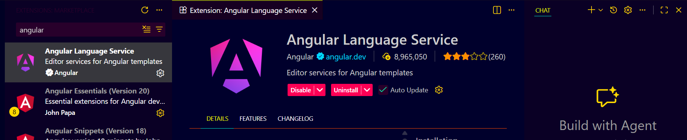

- zone.js => A libraryu which automatically track async operation to trigger change detections.
- Now zone.js is not require. Angular intoduse signals 

- To create angular project => `ng new <project-name>`

## Angular application starting point

`<project> -> src -> index.html`

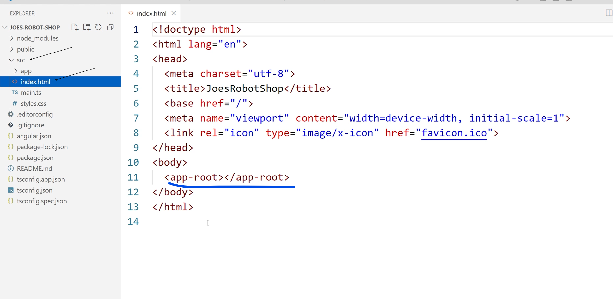

- app-root is not a standated html element, this is first build in angular syntaxt and this is called **Component Selector** refering to our app component which is inside the app folder/app.ts file
- Angular application is first loaded in the browser, first it load index.html file, which then uses the app-root selector to load our app component.
- And the UI and html of app component is in app/app.html.

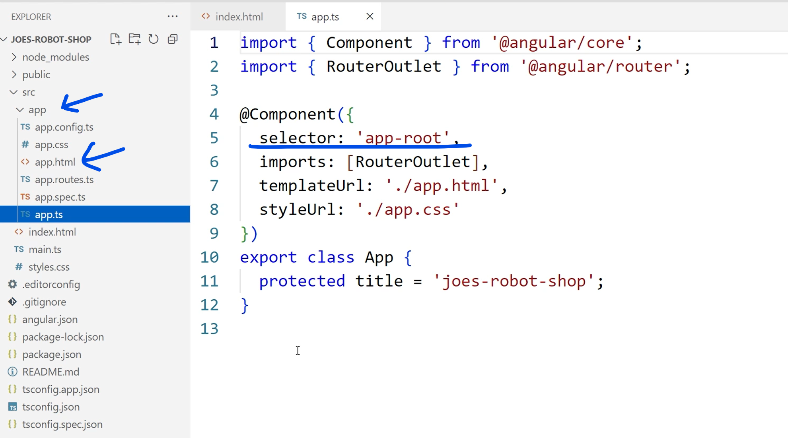

## Run application 

- npm start

- One more importent pice to new angular application and that is main.ts file.
- This TypeScript file is essentially what bootstraps our Angular app when our app first loads. So the index.html file essentially defines what we want to render or display via our app component, but the main.ts file is what allows us to initialize and configure our app with all of the behind‑the‑scenes configuration that it needs. 
- What we'll most commonly do in this file is define services and components to which we want to be available globally in our application, among a few other things. Notice that this file loads this app.config configuration file. And if we take a look at app.config, it's just loading up some global providers to provide things like zoneless change detection and the routing for our application, which will allow us to navigate between different pages of our app.

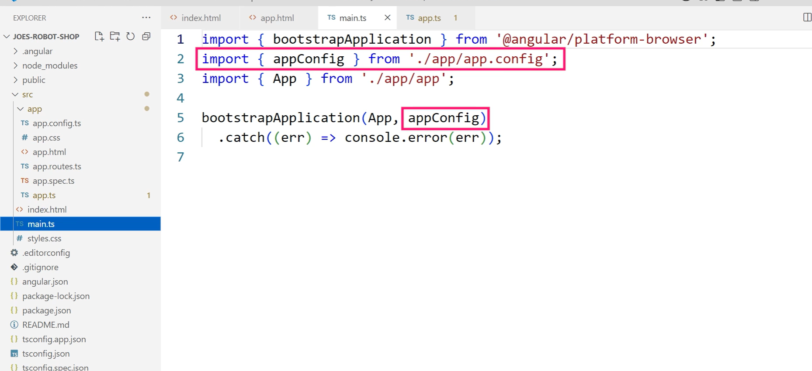

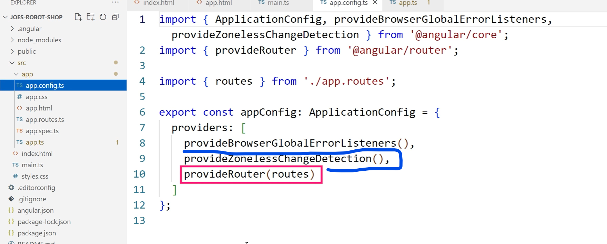

- src/style.css, this is the global stylesheet.

# TypeScript 

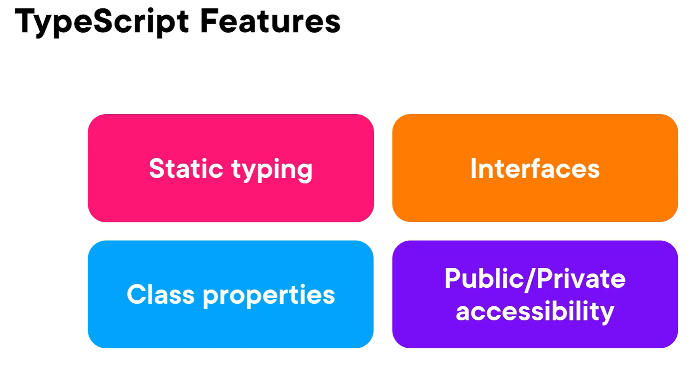

- Static typing allows us to specify data types for variables, properties, and parameters, etc. In plain JavaScript, we declare variables like this, adding types to these variables with TypeScript is as simple as adding the data types to the variable declarations, like this. With this in place, if you were to try to set any of these to an invalid value, for example, setting age to a string value, your TypeScript compiler would throw an error and would fail to transpile so adding types to variables is as simple as this.

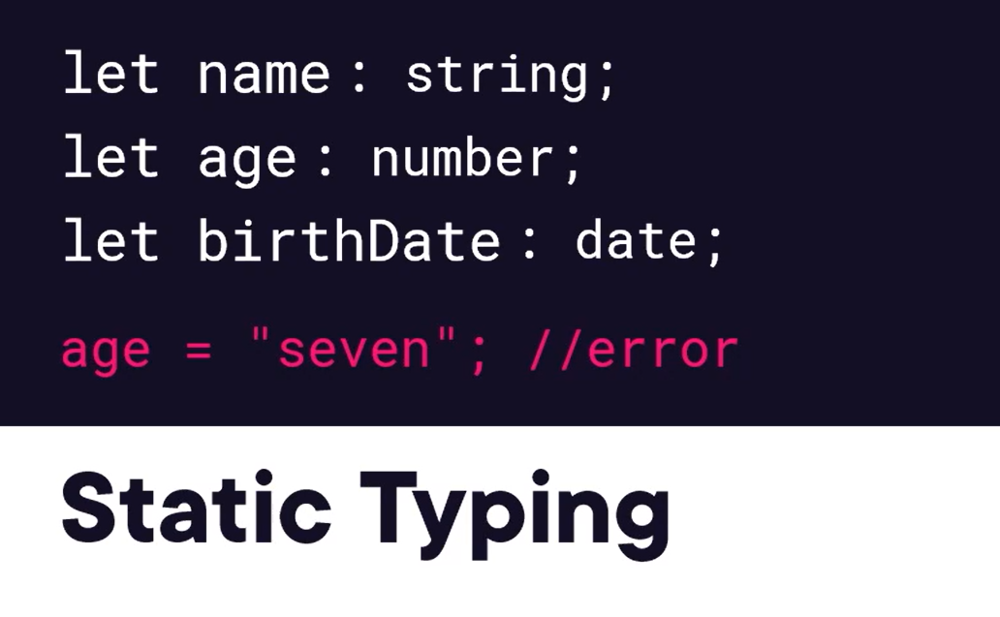

- you can actually define interfaces for entire objects, and that will enforce the shape of objects. So if we wanted to ensure that all cats had a string name, property, and a numeric age property, we could create an interface like this, and then you can declare variables of this type like this. Given this interface declaration, we will get compile time safety if we try to assign an object to fluffy that does not include these fields with these types. 

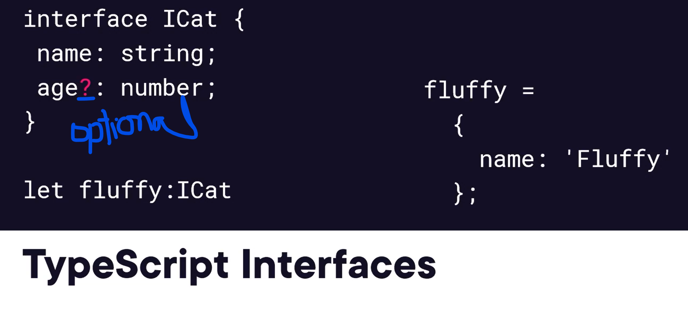

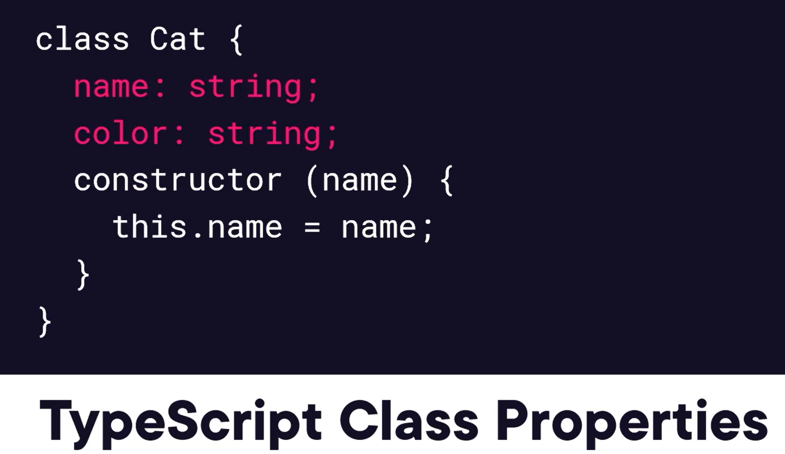

- Class members are by default public and if want to make it provate, we can write the private keyword before that.

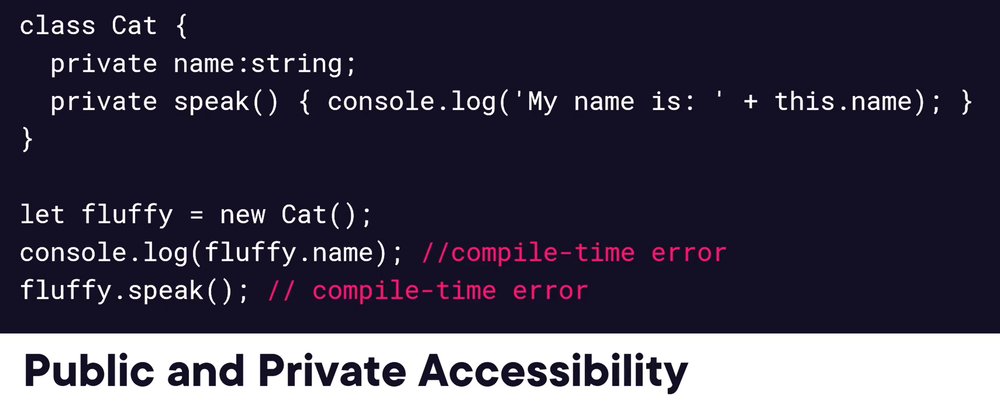

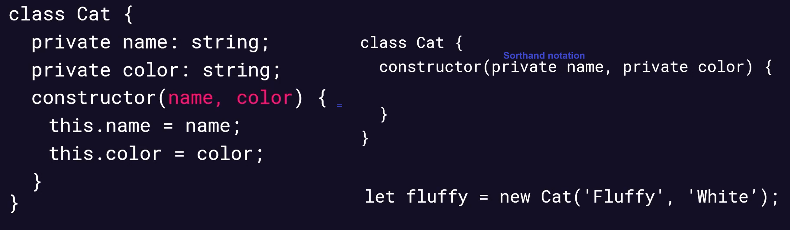

# Standalone Angular Components

## What is Components

- A component manages both the visual layout and the behavior of a single part of the user interface. Components can be as large as an entire web page, or they can handle just one part of a page or even something as small as a single button, although that level of granularity is a little less common. 
-In Angular, components not only handle what the user sees, but also what happens when the user interacts with the UI. 

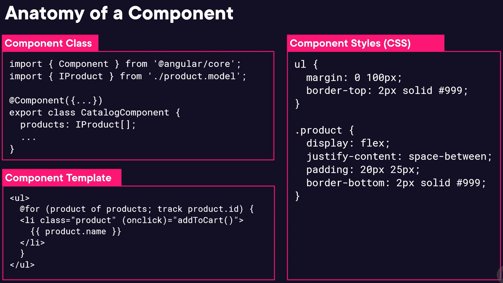

## Create Component 

- `ng generate component <relative-path>/<component>` OR `ng g c <relative-path>/<component>` 
- If we want type=component in that case `ng g c <relative-path>/<component> --type=component`. It will add .component in all the files.
- It will containe 4 files, html, css, ts, spec.ts(Here we can write Unit test of the component.)

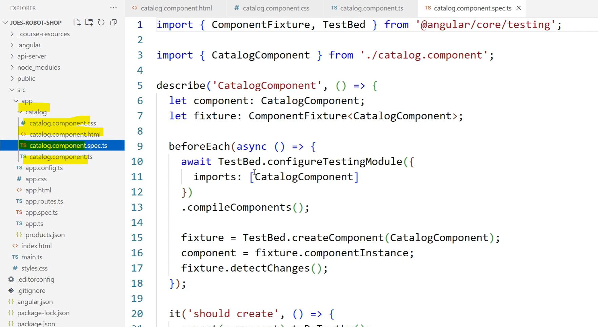

### .ts file

- It will containe all the logic of the component.

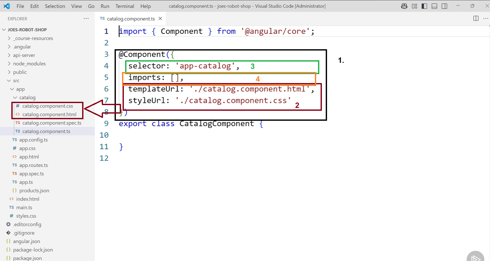

- 1. Decorator - It is a special TS feature that can be use to be attach meta data of class or other unit of code. So Component decorator is going to treat the class as component and attached the required meta data to the class.
- 2. templateUrl and styleUrl meta data. This will tell the path of design and style file path.
    - These css is isolated with respective component only.
- App component is the first component, it will always display when our app is loaded in the browser.
- 3. Selector, which we will write where we want to use the component.
- 4. imports, if we are going to use other component, we will import their component classes in this. First we will import it on top and then we have to write that class name here, which we are going to use in out design template.
- Mordern Angular uses standalong component, that means each component must imports everything which it instent to use seuch as other components and services..

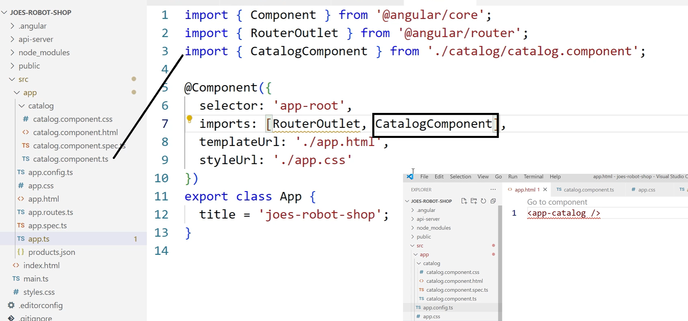

### Defining the Selector Prefix for Componets

- Default prefix is `app-`, that is good for main components.
- It will be good practice to have 3 to 4 char for the compoennt prefix.
- We can change that as default from angular.json file

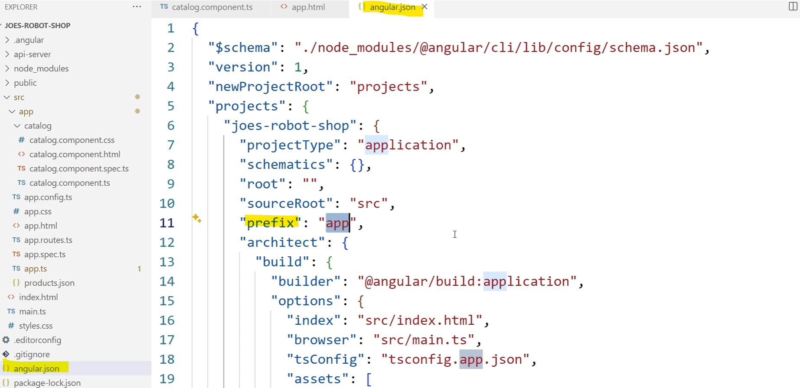

### Accessing and Displaying Images

- Place all the images in public folder.

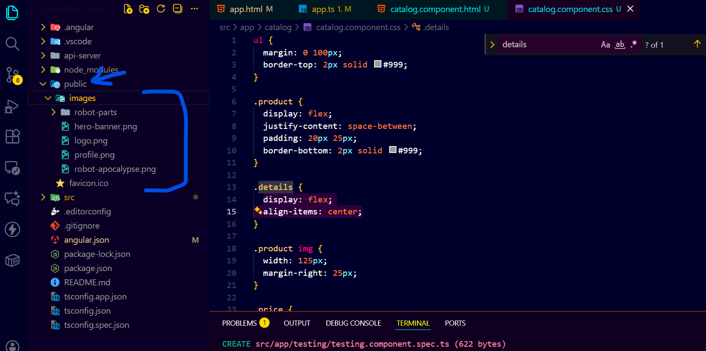

- Whenever angular application is build and deploy to production server, contents in the public folder copied as is to the root to the application which means we can access that from there to the component template.

### Reusable Child Components

- An Angular application is made up of a hierarchy of components with the app component always at the top of the hierarchy. The app component then loads other components, and those components may load additional child components. So components often have a parent‑child relationship with other components. 

## Component Lifecycle Hooks

- Every component in Angular has a lifecycle, and that lifecycle is defined by a series of events that occur throughout the life of the component. And when an event occurs, you can execute code of your own using lifecycle hooks.

- Some of these lifecycle hooks occur only once, and others occur multiple times as data changes throughout the life of the component, so we can group these accordingly. On the left are the lifecycle events that occur only once, and on the right are events that occur every time the components input properties or data changes. 

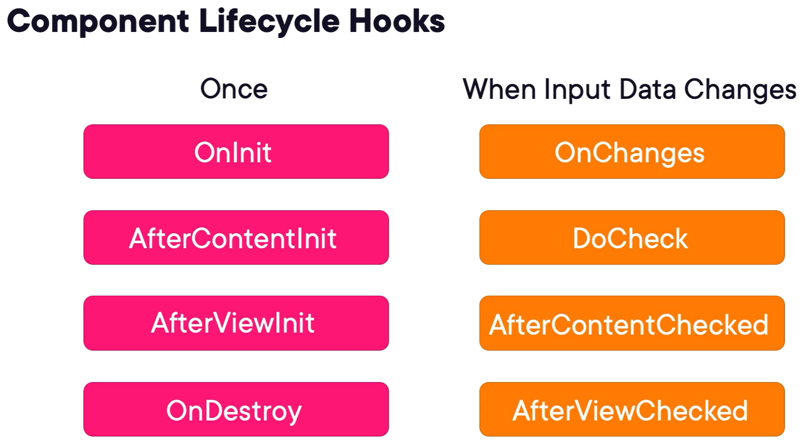

### Order of component lifecycle hooks

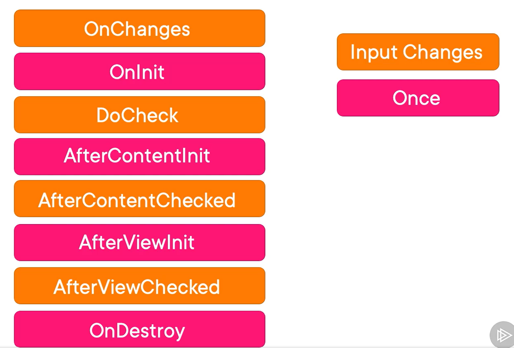

- Commonly used lifecycle hooks

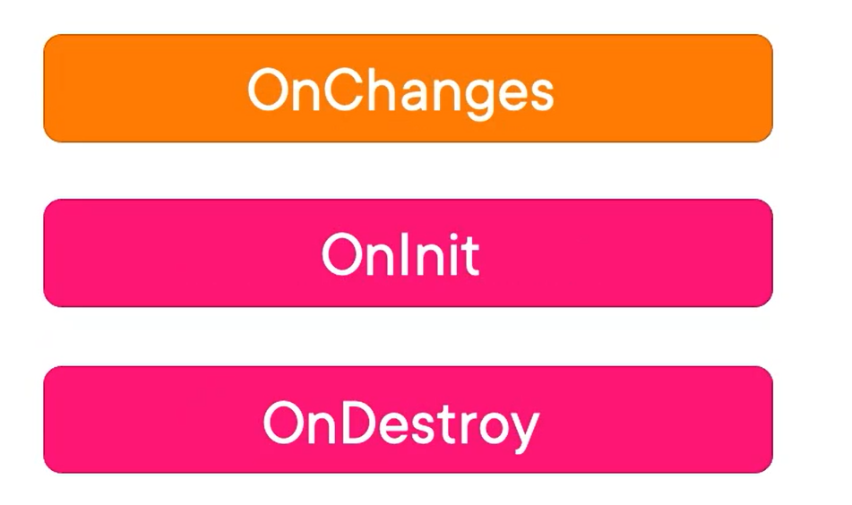

- OnChanges, OnInit, and OnDestroy, and really OnInit is used much more frequently than OnChanges and OnDestroy. We typically use OnInit to fetch data for our components, it's not uncommon, however, that you'll need to do something programmatically when data for your component changes, and that's when you use OnChanges. And OnDestroy is generally just used for clean up to avoid memory leaks.

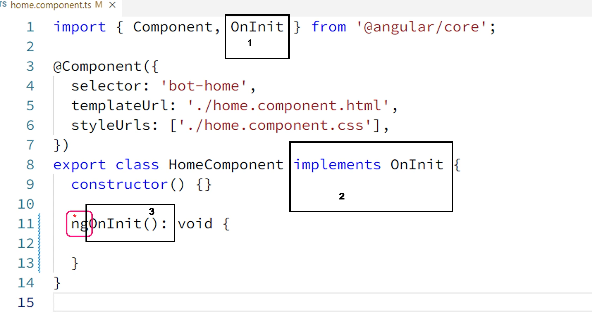

- While importing OnInit follow the step 1-3
- Add prefix ng before OnInit unlike the interface name and write the logic whcih we want to execute when component init.

## Inline Tempates and Styles

- Using in seprate files, it is not required.
- For very simple component, we can use inline template and style directly to compoennt meta data.
- For that instent of templateUrl, we use templete property and we can set to the html/template string using ``.
- For style, we acn change styleUrl property to styles and their also we can pass template string.
- This is generally used for small components.

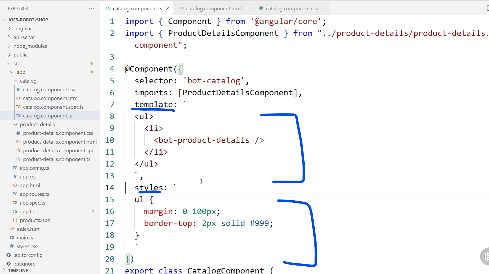

## Angular template syntax and Data Binding

### Interpolation to render expressions

``
- Interpolation is just the process of putting expressions into our HTML that Angular will then evaluate and convert into HTML when it's rendered.

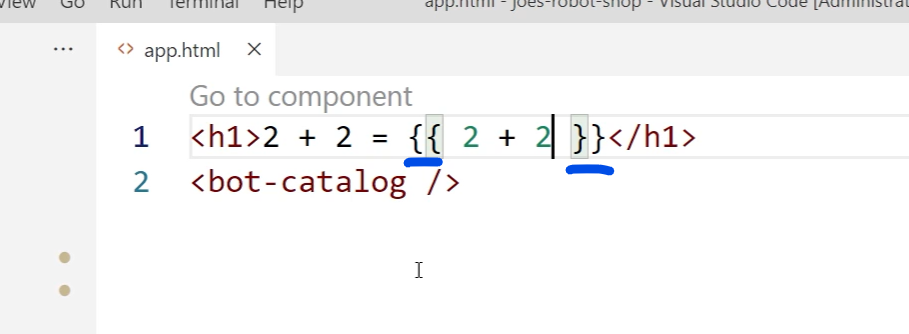

-  Just be aware that you can only put fairly simple expressions in your HTML templates. There are some restrictions.

- If we try to wrap this in something like Math.round like this, if we take a look at that in our browser, you can see that we're actually getting an error. Angular intentionally limits what you can do in interpolation expressions in order to keep us from putting lots of JavaScript code in our HTML templates, that code should instead reside in the Component class.

### Binding to Component Data with Interpolation

- Adding data binding will stop us to hardcoding data in the component HTML template.
- Most data we will get in the component by making API call to APi server.
- We can define data to the component and component itself.
- Best prectice to use TS datatype/TS interface for the data.

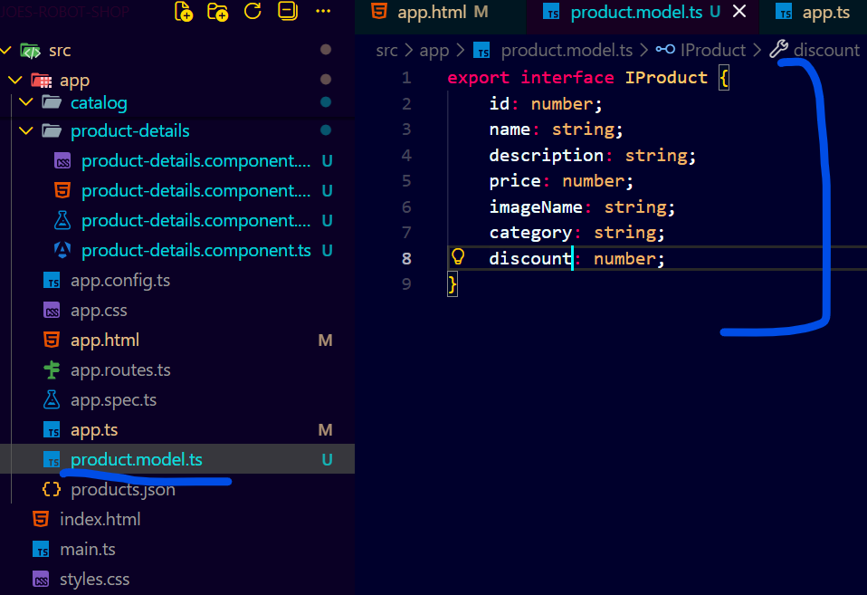

- **Template to access the component's property, that property should be public.**

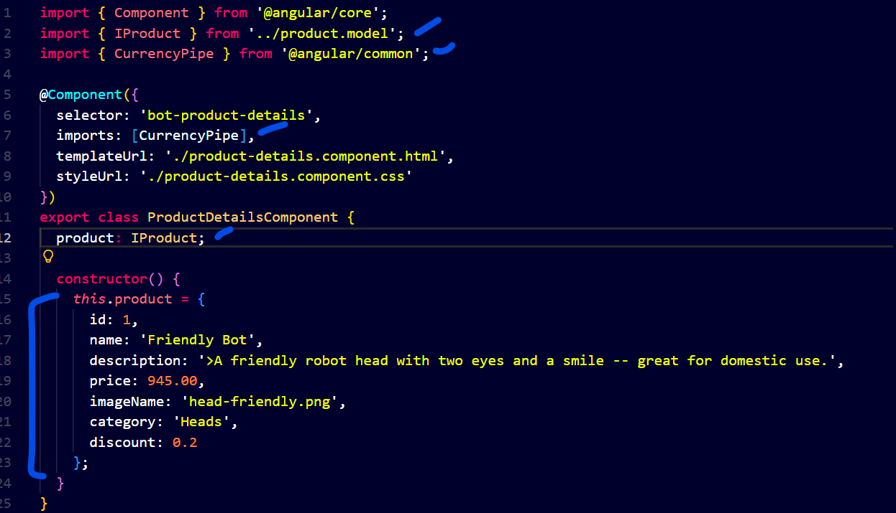

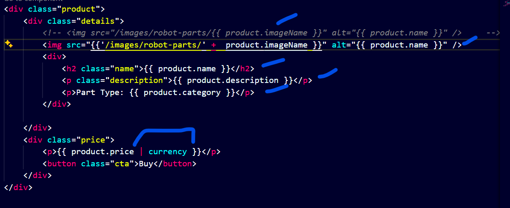

- For formating, we can use .toSrting, other all js things but we can use | pipe things also.
- Pipe we can use to formate the data.
- To use pipe we need to import that.
- Images interplatin we can do in many ways. That is ups to the developer.

### Attribute Binding
- We are binding the attribute to the expression.
- In above, if we see alt attribut, we are doing interpolation.
- We can bind attribut using square brackets [] in attribute and pass value directly to the attribut without {{ }}
-  Then it's also good to understand that this is just a one‑way binding, square brackets create a binding only in the direction from the component class to the HTML attribute.  
- [] create the one way binding from component class to the templates.

### Calling function from a component Template

- We can actually bind them to functions, or perhaps more accurately, bind them to the return value of a function, this is helpful when you want to do something more complex or execute some logic that isn't supported by an inline template expression.

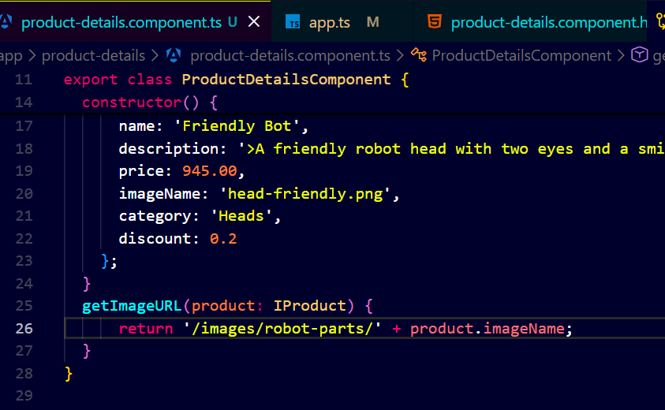

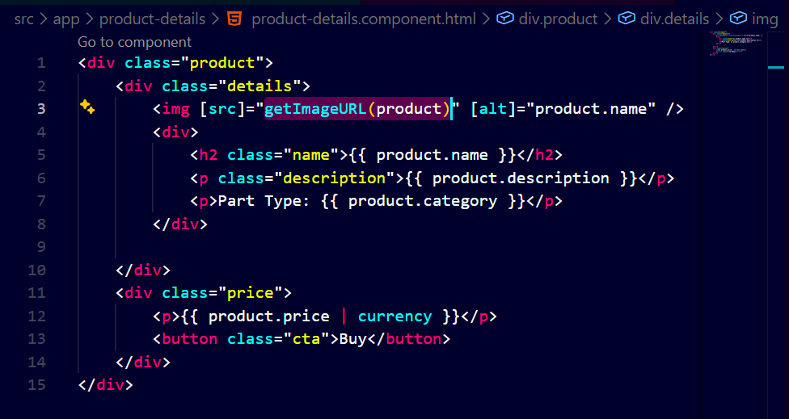

### Responding to User Events

- Bind events using perentheses. We can mention event in the perentheses.
- Passing attribute attribute from template.
- If we want to send event to the component file we can pass as attribute $event.

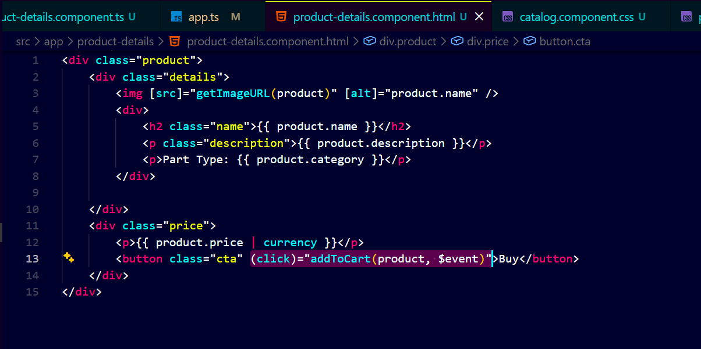

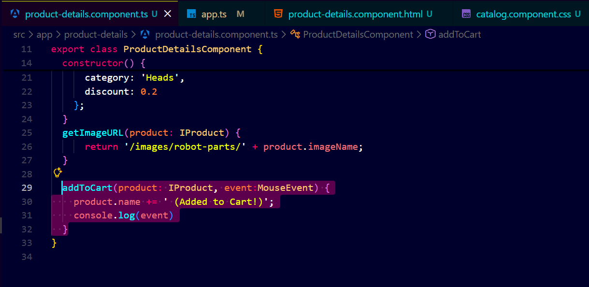

### Data Binding and Angular Change detection

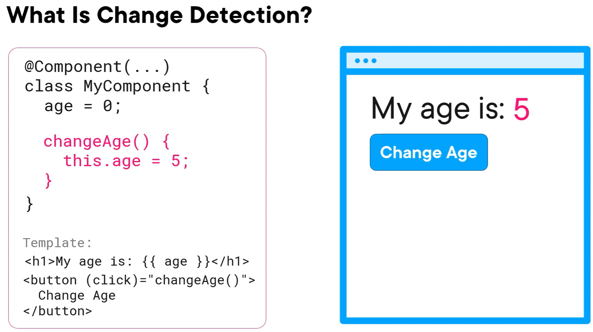

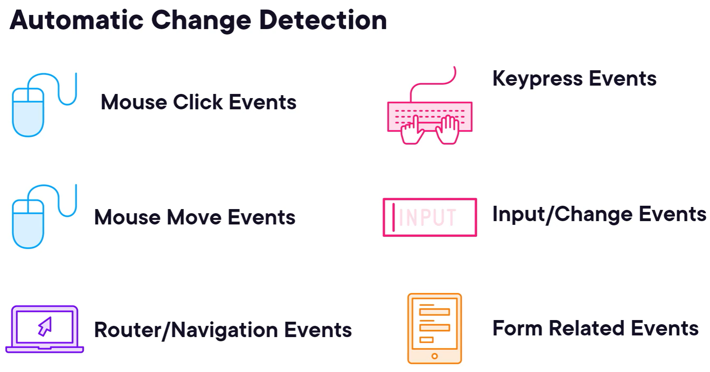

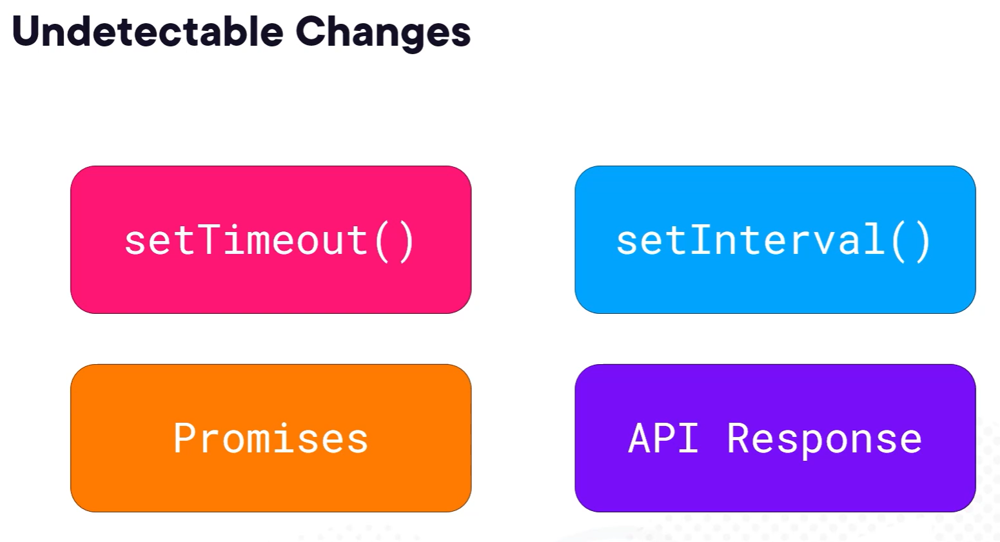

- Normally binded data is going to chanage in DOM like using events called mouse and keyboard events.
- Angular is automatically handle change detuction responce to user events.
- But in many cases like async things like setIntervel, setTimeout, Promise, API call Angular can not identify directly.
- In older verson if angular is going to handle that things using Zone Js
- But now Angular have neat approch called Signals 

### Handling Asynchronous Changes with Signals

-  An Angular Signal is kind of like a variable that automatically tracks dependencies and notifies Angular when it changes, thus allowing the UI to update without manually forcing change detection.
- First import the signal from the angular/core and signal is acctuly a function. `import { Component, signal} from '@angular/core'
`
- Call that signal as function in variable's value like `availableInventory = signal(3)` 
-  Under the covers, a WriteableSignal is actually a function, but it's a function that also has properties like an object does. Keep in mind that in JavaScript and TypeScript, functions can also behave like objects that have properties. So a signal is a complex function/object which tracks a value, but it also ties into Angular's change detection so that it can notify Angular when its value changes. But for to work, when you access a signal's value, you need to actually call the signal like a function.
- To update signal, we can use set function to update the signals.
- We need to use signal whenever we work on async changes. 

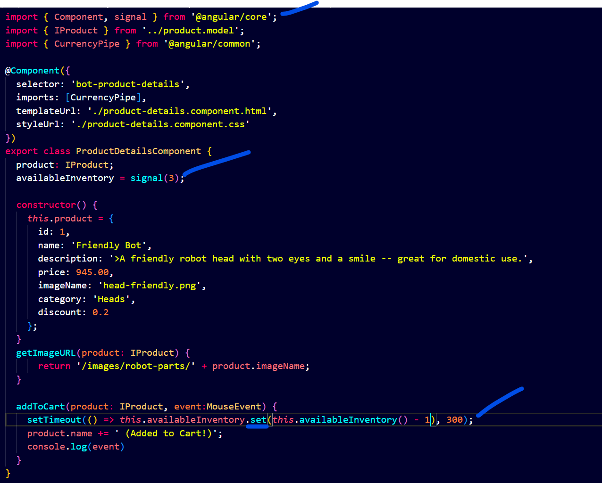

-  The set function is great for simple cases like simply setting its value
- But whenever you use the prior value of a signal to determine the new value, you actually need to use a slightly different syntax. So, instead of calling set here, We can call update. 
-  And update actually takes in a callback function, which it will call to update the signal value so we pass in a function, and that callback function receives the prior value of the signal, and then we can just use that prior value here to set the new value.

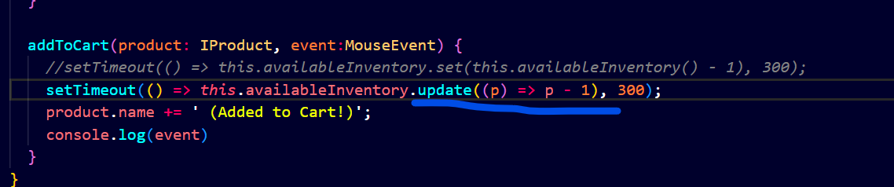

### Passing Data to Child Components with input Properties

- In the component, we need to import input from angular/core. `import { input } from @angular/core`.
- Defind the variable in component which we are going to use in component as input.
- input property is also a type of signal. So we need to treat as input, and call it like a function.
`
 product = input<typeofInput>();
 \\ Required Input
 product = input.required<typeofInput>();
 \\ Example
 product = input.required<IProduct>();

 \\ Uses
 {{product().name}}
`

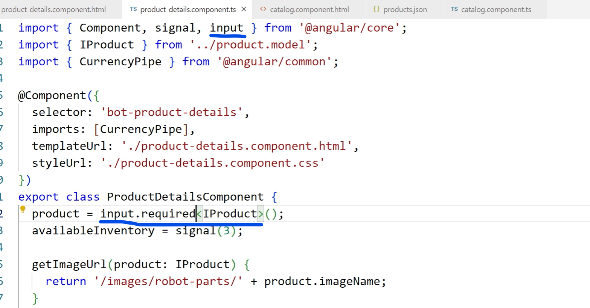
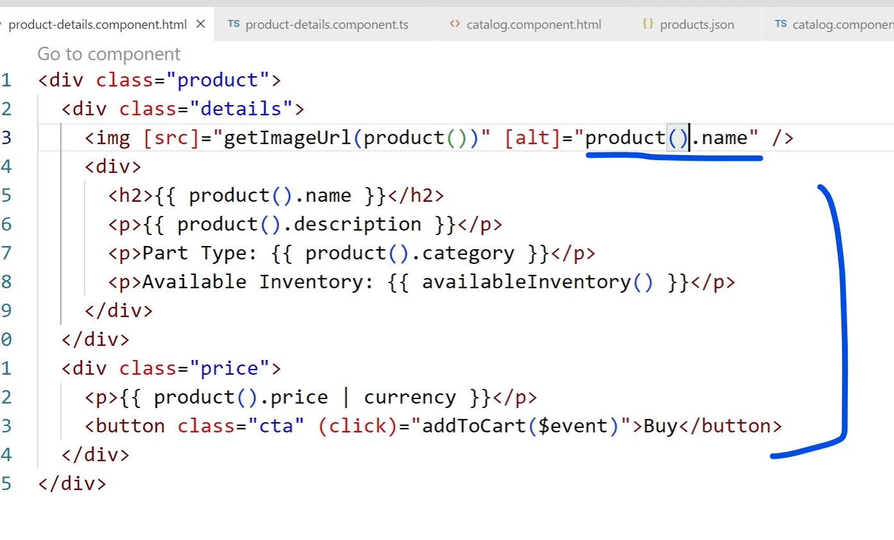

- Pass from parent component like property binding in []

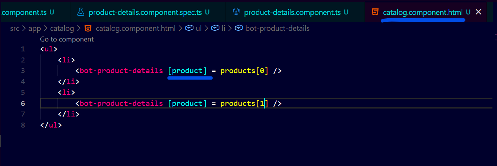

### Rendering Lists (For Loop)

- We can use for loop like 
`
@for (producvt of products; track product.id){

}
`
- We have an @ followed by the word for, this is called a control‑flow construct, meaning it controls how Angular processes and displays part of your template based on conditions or repetition.
- Similar to how loops or conditional if statements work in regular code. Basically, this @for block is saying for each item in the item's array, render the content inside these braces.
- For loop requires a track clause.
- For performance reasons, it's important for Angular to be able to uniquely identify each item it renders inside a for loop, that way, if the data for one of the items changes, it can efficiently re‑render just that one item in the DOM instead of having to re‑render the entire list. So I'm telling Angular that it can use the identifier to uniquely identify each item in the array.

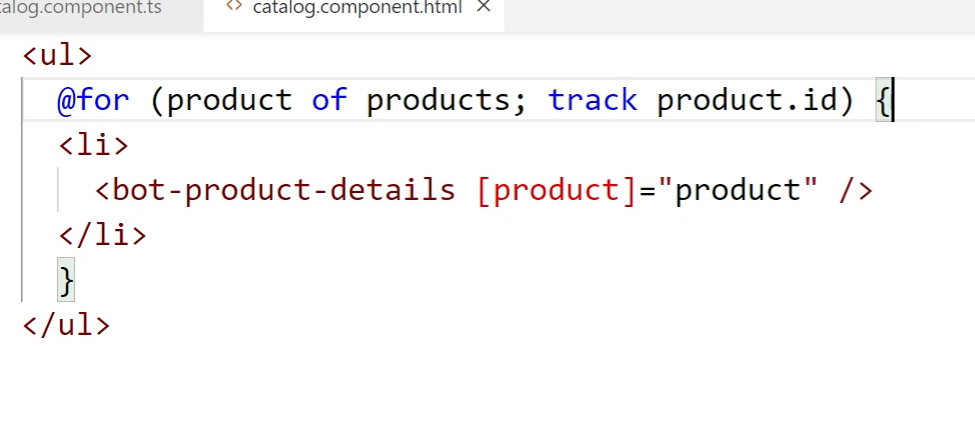

### Conditionally Rendering Content

- For conditional things we normally use if - else in the angular
- If condition is also starts with control‑flow construct @ simmilarly as for loop.

`
@if(consition) {
    // condition truthy code
} @else {
    // Condition falsy code
}

-----
@if(consition 1) {
    // condition 1 truthy code
} @else if(condition 2){
    // condition 2 truthy code
} @else {
    // Condition falsy code
}

`

## Styling Angular Components

### Angular CSS: Global Styles v/s Component Styles

- Globally style css class we can write in src/style.css.
- Global css will apply accross all the components.
- This is not the one place which can be globally applied css.
- In angular.json file, we can add/modify the global css files in "styles":[] array

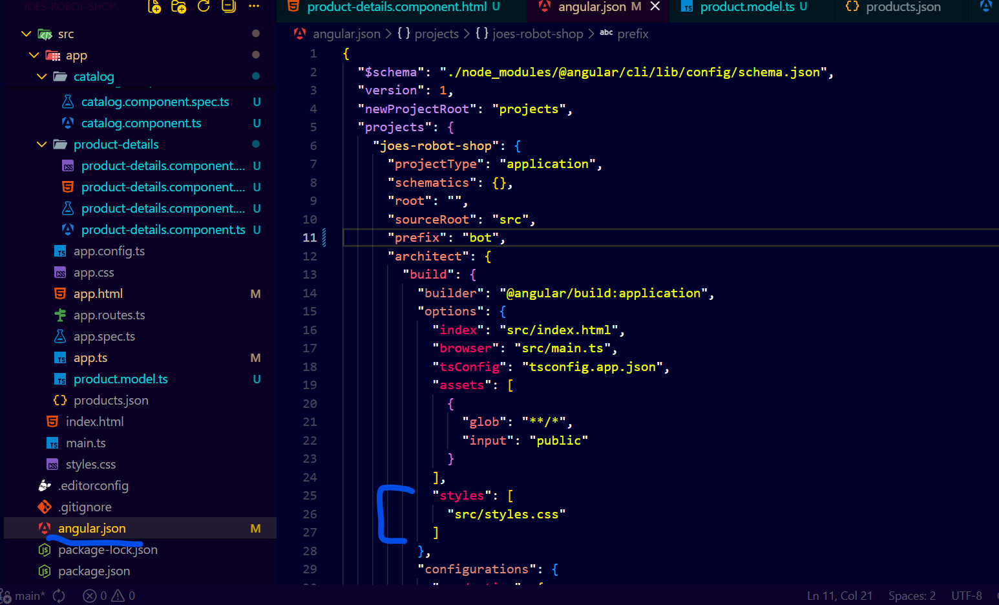

- In Angular we can write css at the component level as well.
- That styles is going to impect only inside the component only not globally.

### Conditionally Applying CSS classes with class bindings 

- We can bind css class based on condition, for that we use spacial class binding thing like 
`
 '
] = "consition">
'

  '
[class.strikthrough] = "product().discount > 0"
'
`

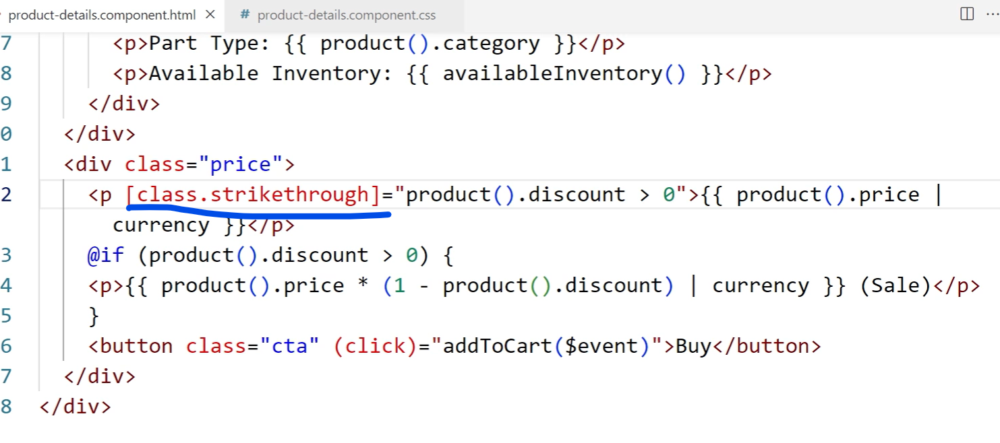

### Applying CSS classes with the ngClass Directive

- Class binding is good if we have single class.
- If we have multiple classes which we want to conditionally apply, we use ngClass directive binding.
- In order to use ngClass, we need to import that in our component class.

`
import {NgClass} from '@angular/common';

@Component({
    imports:[NgClass]
})

`

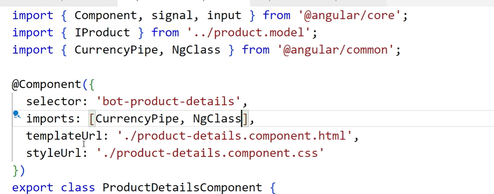

- In template we bind ngClass to a javascript object.
- In that object property name will be our css class which we want to apply and the value will be the condition.
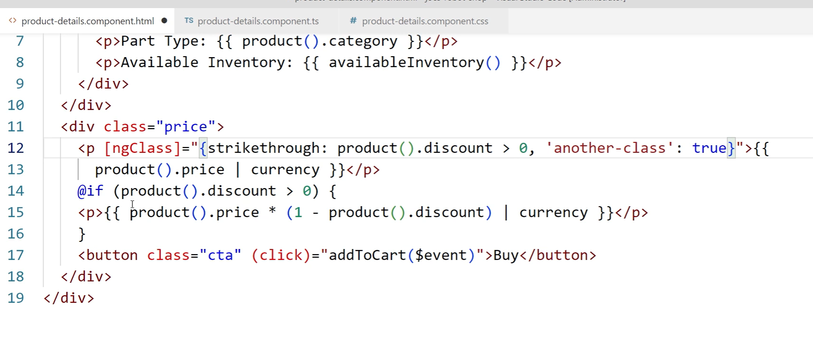
- In ngClass we write JS expresstion, if we have css class with - seprated, in that case use that class as stying inside ''.
- Instent of binding ngClass to out template, we can bind ngClass to our function call so that out HTML syntax will neat and clean.

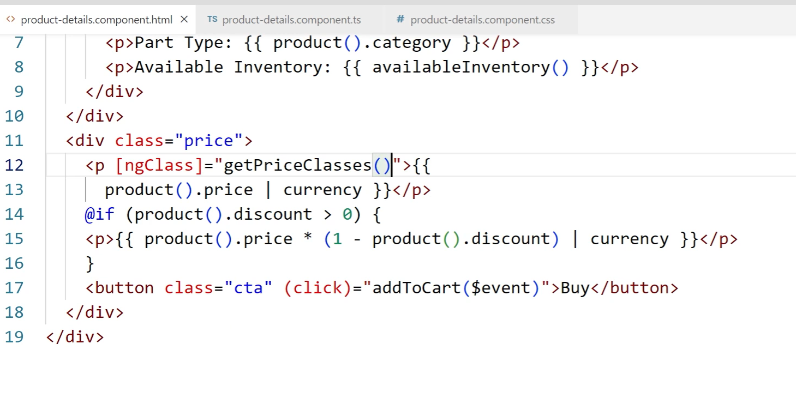

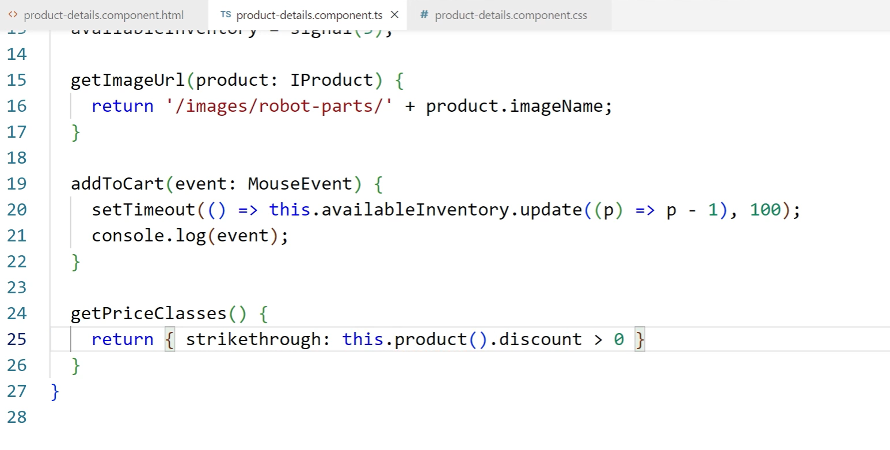

### Styling a Component's Host Element

- Many time we want to give styling to out component selector. For example some time in \<app-child-component\>, in that we can give styling to :host selector.

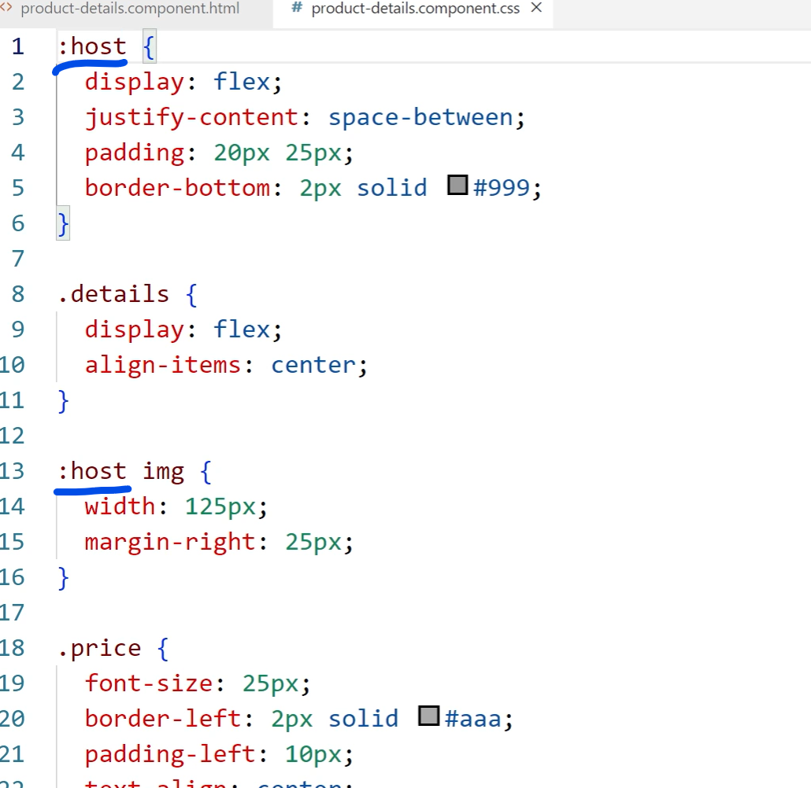

# Angular Routing and Navigation

- In web frameworks like Angular, routing refers to the process of mapping URLs to components so that when a user navigates to a URL on our website, the app knows which component to render to display the corresponding page. 

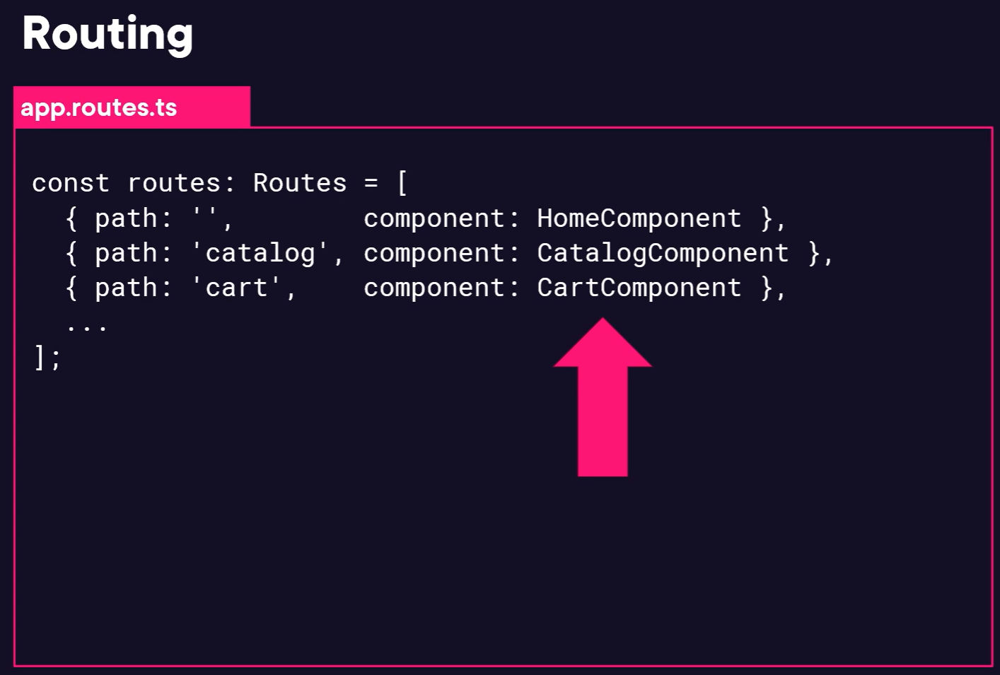

## Routing

- For routing, we have one file called app.routers.ts, in that we have one array called routes, there we need to pass our all routers.
- "" blank path means, this is the default url, and while loading app, that component is going to render.
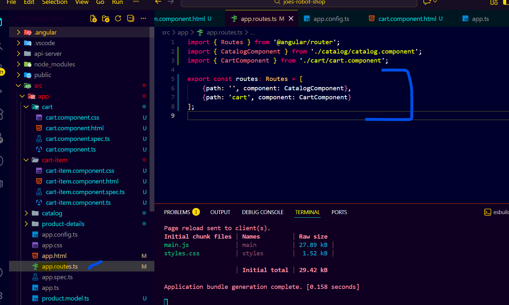

- Using redirect routes also we can manage the first component load.
- In that we can give redirectTo as url path, and in that case pathMatch property is required.

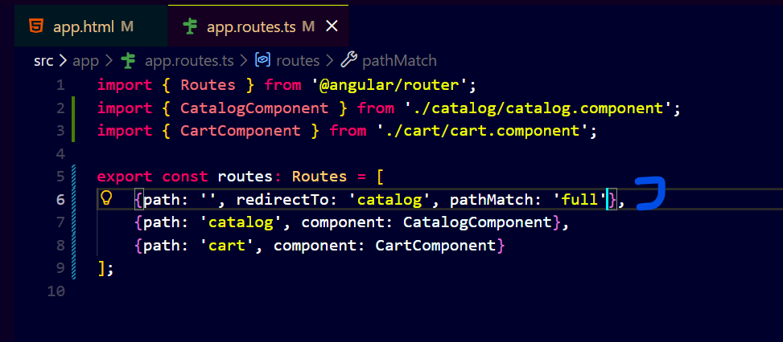

- That routes array is imported in app.config.ts file 
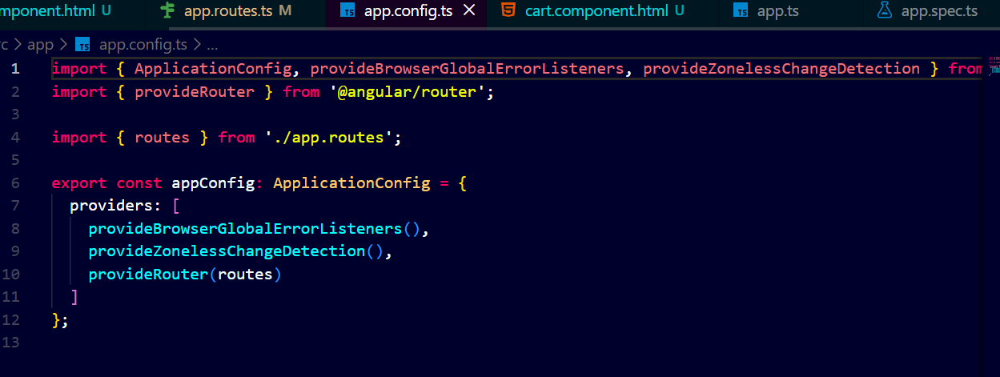

- To make routing enable, we need to import router-outlet in app.html(out default component which is going to load first time)

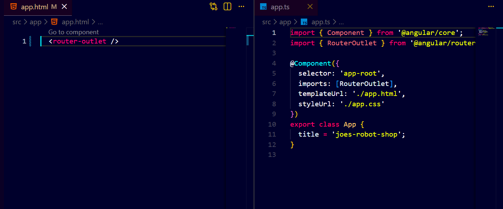

## Linking to Routes

- For that we can use routeLink property and that we can set to our router path.
- That we need to import in our component class.

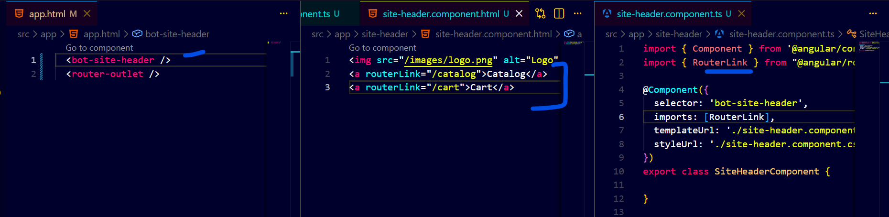

# Creasting and Using Angular Services

## What are Angular Services

-  Well, the short answer is that a service in Angular is simply a TypeScript class that we call to perform some action or store data.

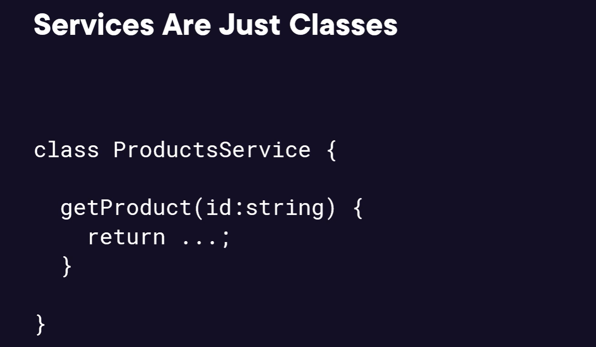

### Why are Services Necessary?

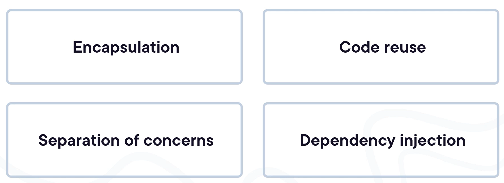

## Creating an Angular Service

- Using Angular CLI

    `
        ng g service <service-name> --type=service
        ng g service products --type=service
    `
- Service is not going to create their own folder because Service is a single file along with it's test file.
- Services are made available to our application through providers. Providers basically determine how a service is created and things like when to create a single shared instance of a service or whether to create multiple unique instances of a service.

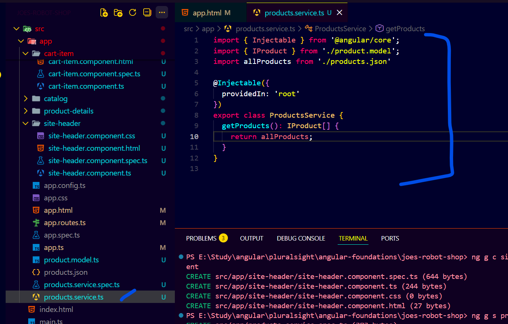

## Inject and Using an Angular Service

- We can use services in our component via Constructor injection 

`
import { ServiceName } from './service.service'
export class Component {
    constructor(private variableService: ServiceName)
}
`
- Imported Service should be injectable 

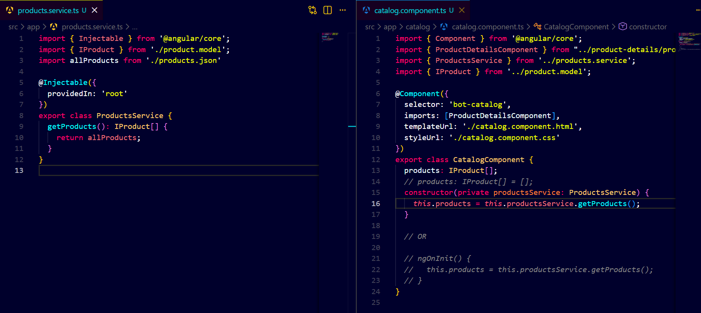

- We can user services in both the type: normal as well as ngOnInit().

## Managing Application State with Angular Services

- We can create service for the specific functionality and we can use that in our application.
- We can use state management using services.
- Here we created Cart service and using that on multiple places.
- Cart related functionality is written in the cart service only.
- To add and remove cart we wrote the functionality in service.
- Serviceis only going to handle the cart array. 
- To make it inrective, we use signals.

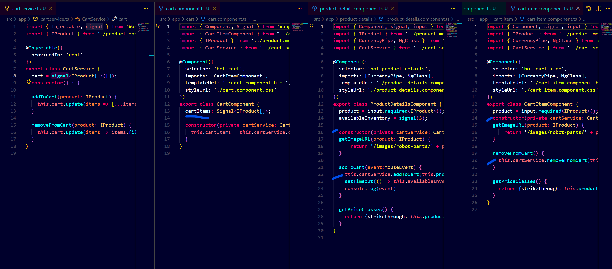

## Creating an API Proxy

- Because of backend and frontend, both the project is running on diffrent diffrent path and it will cause cross browser compatibility issue. 
- To fix that, API proxy is comes into the picture.
- Normally that is causes in our local dev environment.
-  This proxy server will essentially make our Angular application believe that everything is all running on the same port as our Angular app
- For that we will create one proxy.conf.json file in the root of our frontend app.
- It will containe one JSON object, one key will be our server path. Usually that might be "/api"
- value of "/api": will be again one object which will holds the meta data of the server related stuff
`
// proxy.conf.jsob

{
    "/api":{
        "target": "htte://localhost:8081"
    }
}
`
- In angular.json file -> serve section, create "options" that will hold the proxyConfig file path

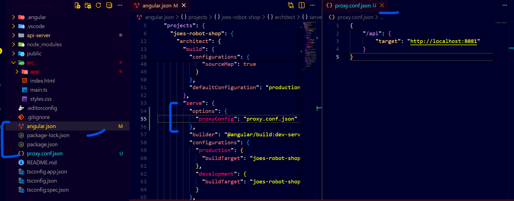

## Calling an API from a Service
- For that we can use observables or signals for this.
- Configure app to make compatable to have access with http resources.
- for that in app.config.ts file, add new provider that provides http services to our angular application.
`
   import { provideHttpClient } from '@angular/common/http';

   providers: [
    provideHttpClient()
   ]
`

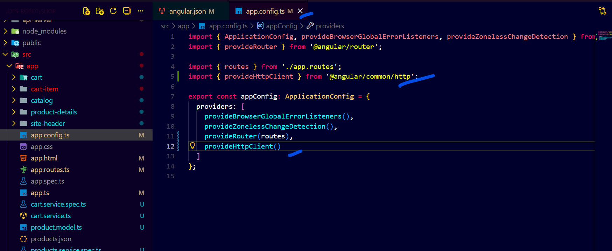

- Use http request we need to import httpRequest in the target location from '@angular/common/http'
- httpResource will have a call back function which returns a url of api endpoint as a string.
- httpResource is a feature in Angular that allows us to fetch data from an API reactively using signals, and we pass along to it the URL of our API endpoint as a callback function. And if we take a look at this resource object, you can see that its data type is HttpResourceRef. So the returned resource is an object specific to making an HTTP call, but it's also wrapped in a signal, so it remains reactive and works well with Angular change detection.
- To make reactive data, use Computed Signals, by wrapping resource value to wrapping in computed function and also import computed from angular core.
- Computed takes in a function which returns the data which we wants to store in the computed signals.
- httpResource will do automatic cache

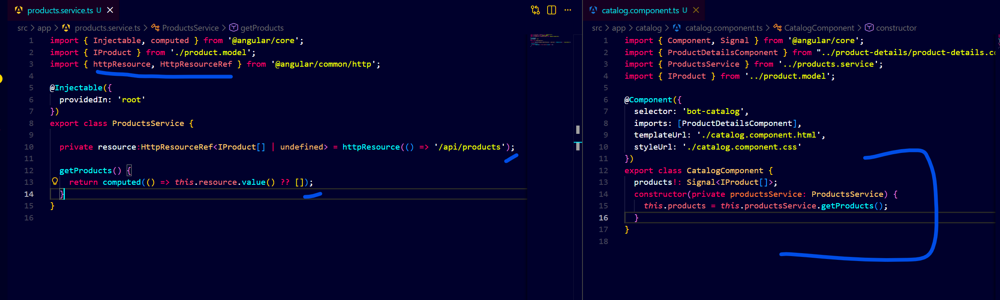

- This will setup the resource to use API call later.
- Actual API call will execute when we access the resource value.

